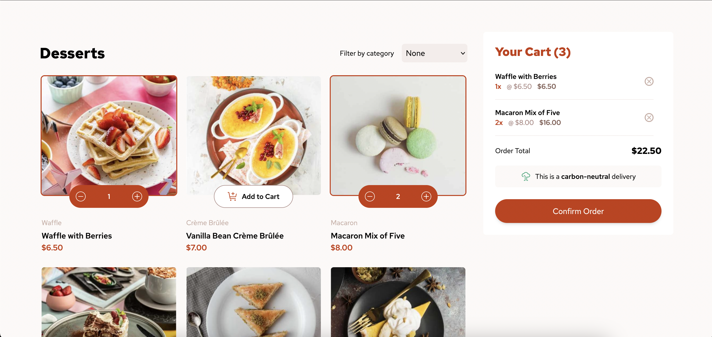

# Frontend Mentor - Product list with cart solution

This is a solution to the [Product list with cart challenge on Frontend Mentor](https://www.frontendmentor.io/challenges/product-list-with-cart-5MmqLVAp_d). Frontend Mentor challenges help you improve your coding skills by building realistic projects.

## Table of contents

- [Overview](#overview)
  - [The challenge](#the-challenge)
  - [Screenshot](#screenshot)
  - [Links](#links)
- [My process](#my-process)
  - [Built with](#built-with)
  - [What I learned](#what-i-learned)
  - [Continued development](#continued-development)
  - [Useful resources](#useful-resources)
- [Author](#author)

## Overview

### The challenge

Users should be able to:

- Add items to the cart and remove them
- Increase/decrease the number of items in the cart
- See an order confirmation modal when they click "Confirm Order"
- Reset their selections when they click "Start New Order"
- View the optimal layout for the interface depending on their device's screen size
- See hover and focus states for all interactive elements on the page

### Screenshot

### Links

- Solution URL: [https://github.com/Esosek/desserts-shop](https://github.com/Esosek/desserts-shop)
- Live Site URL: [https://desserts-shop-tau.vercel.app/](https://desserts-shop-tau.vercel.app/)

## My process

### Built with

- [React](https://reactjs.org/) - JS library
- [Next.js](https://nextjs.org/) - React framework
- [TailwindCSS](https://tailwindcss.com/) - A utility-first CSS framework
- CSS Modules used for keyframe animations

### What I learned

- I refreshed and deepened my knowledge in testing React apps using Jest and react-testing-library (RTL)
- I learned how to setup Jest and RTL for TypeScript
- I finally applied basics of keyframe animations

### Useful resources

- [Net Ninja - Integration Tests](https://www.youtube.com/watch?v=6wbnwsKrnYU&t=875s) - This video helped me with writing better tests
- [React - The Complete Guide by Maximilian Schwarzmüller](https://www.udemy.com/course/react-the-complete-guide-incl-redux) - Overall great course but I used it for learning how to test React applications in this project

## Author

- Frontend Mentor - [@Esosek](https://www.frontendmentor.io/profile/Esosek)
